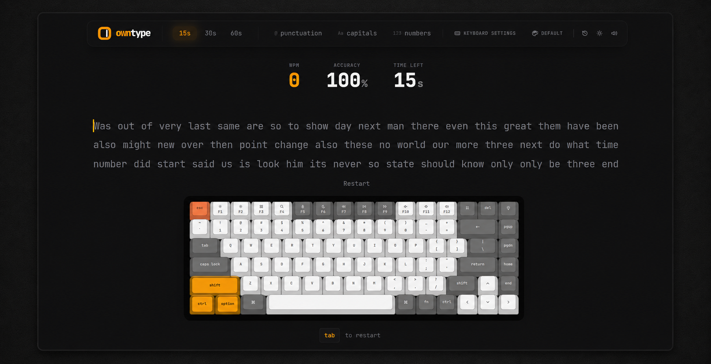
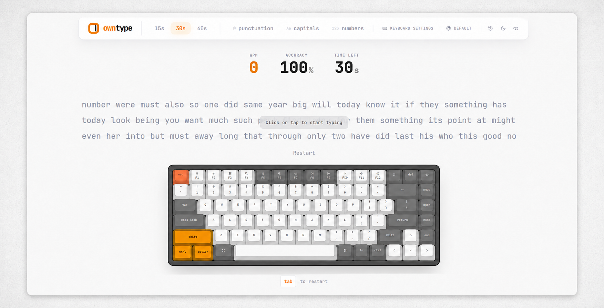
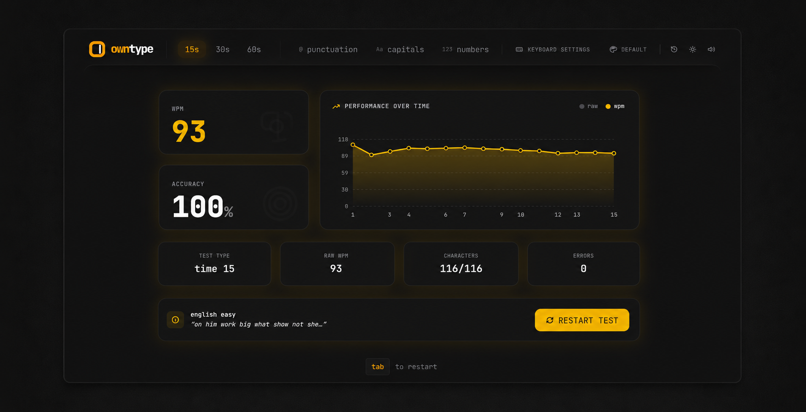
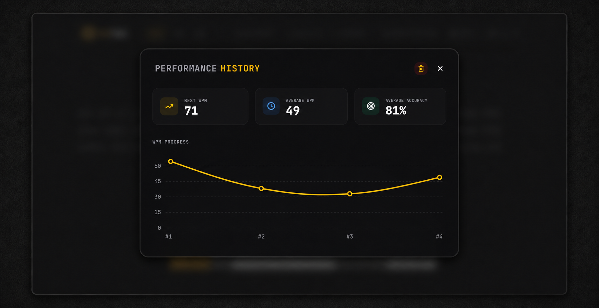

<div align="center">

# OwnType

### A Minimal, High-Performance Typing Speed Test

**Measure your WPM · Track your accuracy · Improve over time**

[](https://nextjs.org/)
[](https://react.dev/)
[](https://www.typescriptlang.org/)
[](https://tailwindcss.com/)
[](LICENSE)

<br />

[**Live Demo →**](#) · [Report Bug](../../issues) · [Request Feature](../../issues)

</div>

<br />

## Screenshots

<div align="center">

<table>
<tr>
<td width="50%"><strong>Dark Mode</strong></td>
<td width="50%"><strong>Light Mode</strong></td>
</tr>
<tr>
<td></td>
<td></td>
</tr>
</table>

<br />

<table>
<tr>
<td width="50%"><strong>Results Dashboard</strong></td>
<td width="50%"><strong>Performance History</strong></td>
</tr>
<tr>
<td></td>
<td></td>
</tr>
</table>

</div>

<br />

---

## Features

<table>
<tr>
<td width="50%">

### Core Typing Test
- **15s, 30s, 60s** timed test modes
- Real-time **WPM**, **accuracy**, and **countdown** display
- Smooth sliding cursor with per-theme styling
- Smart word wrapping with overflow handling

</td>
<td width="50%">

### Themes & Customization
- **6 curated keyboard themes** — Classic, Mint, Royal, Dolch, Sand, Scarlet
- **Light & Dark** mode toggle for each theme
- Interactive virtual keyboard with key-highlighting
- Monospaced JetBrains Mono typography

</td>
</tr>
<tr>
<td width="50%">

### Results & Analytics
- Post-test **performance dashboard** with WPM chart
- Raw WPM vs Net WPM comparison over time
- Detailed stats: characters, errors, test type, accuracy
- **Performance history** modal with best/avg WPM & accuracy trends

</td>
<td width="50%">

### Advanced Options
- Toggle **punctuation**, **capitals**, and **numbers**
- Configurable keyboard **sound effects** & **volume**
- Haptic feedback support for mobile
- **Installable PWA** — add to home screen on any device

</td>
</tr>
</table>

<br />

## Tech Stack

| Technology | Purpose |
|:--|:--|
| [Next.js 16](https://nextjs.org/) | React framework with App Router |
| [React 19](https://react.dev/) | UI rendering with concurrent features |
| [TypeScript 5](https://www.typescriptlang.org/) | Type-safe development |
| [Tailwind CSS 4](https://tailwindcss.com/) | Utility-first styling |
| LocalStorage API | Persist settings, themes & test history |

<br />

## Getting Started

### Prerequisites

- **Node.js** 18+ or **Bun** runtime
- **npm**, **yarn**, **pnpm**, or **bun** package manager

### Installation

```bash
# Clone the repository
git clone https://github.com/your-username/own-type.git
cd own-type

# Install dependencies
npm install
# or
bun install

# Start the development server
npm run dev
# or
bun run dev
```

Open [http://localhost:3000](http://localhost:3000) in your browser.

### Available Scripts

| Command | Description |
|:--|:--|
| `npm run dev` | Start development server with hot reload |
| `npm run build` | Create optimized production build |
| `npm run start` | Serve the production build locally |
| `npm run lint` | Run ESLint for code quality checks |
| `npm run typecheck` | Run TypeScript compiler checks |

<br />

## Project Structure

```
own-type/
├── app/                    # Next.js App Router
│   ├── layout.tsx          # Root layout with font & providers
│   ├── page.tsx            # Home page shell
│   ├── site-config.ts      # SEO metadata & URL resolution
│   ├── manifest.ts         # PWA web app manifest
│   ├── robots.ts           # Search engine crawl rules
│   └── sitemap.ts          # Auto-generated sitemap
│
├── components/             # React UI components
│   ├── TypingTest.tsx       # Main orchestrator component
│   ├── WordDisplay.tsx      # Word rendering with sliding cursor
│   ├── ModeSelector.tsx     # Navbar with timer/mode controls
│   ├── Stats.tsx            # Live WPM, accuracy & timer display
│   ├── ResultsDashboard.tsx # Post-test results with SVG chart
│   ├── HistoryModal.tsx     # Performance history with trend graph
│   ├── VirtualKeyboard.tsx  # Interactive on-screen keyboard
│   └── KeyboardSettingsModal.tsx # Theme & sound preferences
│
├── hooks/
│   └── useTypingEngine.ts   # Core engine: timer, input, counters
│
├── context/
│   └── KeyboardSettingsContext.tsx # Persisted user preferences
│
├── utils/                   # Pure utility functions
│   ├── wordGenerator.ts     # Word pool with punctuation/caps/numbers
│   ├── statistics.ts        # WPM & accuracy calculations
│   └── localStorage.ts      # Type-safe storage helpers
│
├── types/                   # Shared TypeScript interfaces
├── styles/                  # Global CSS & Tailwind config
└── public/                  # Static assets & favicons
```

<br />

## How It Works

The typing engine (`useTypingEngine`) is designed for **zero-lag input handling**:

1. **Incremental Counters** — Character states update on every keystroke without re-measuring layout
2. **GPU-Accelerated Cursor** — The caret is positioned via CSS transforms attached directly to the active character element
3. **Efficient Timer** — The countdown publishes once per visible second, not on every frame
4. **Smart Overflow** — Words scroll into view as you type, with the active word always visible
5. **10-Character Error Cap** — Extra wrong characters are limited to 10 per word, matching competitive typing test standards

<br />

## Deployment

### Vercel (Recommended)

[](https://vercel.com/new/clone?repository-url=https://github.com/your-username/own-type)

Vercel auto-detects `VERCEL_PROJECT_PRODUCTION_URL` for canonical URLs, sitemap, and social metadata.

### Other Hosts

Set the `NEXT_PUBLIC_SITE_URL` environment variable:

```bash
NEXT_PUBLIC_SITE_URL=https://yourdomain.com
```

<br />

## Privacy

OwnType respects your privacy:

- **No accounts** — no sign-up or login required
- **No server calls** — all test data stays in your browser
- **LocalStorage only** — typing history and preferences are stored locally
- **No tracking** — zero analytics or third-party scripts

<br />

## Contributing

Contributions are welcome! Here's how:

1. **Fork** the repository
2. **Create** a feature branch (`git checkout -b feature/amazing-feature`)
3. **Commit** your changes (`git commit -m 'Add amazing feature'`)
4. **Push** to the branch (`git push origin feature/amazing-feature`)
5. **Open** a Pull Request

<br />

## License

This project is licensed under the **MIT License** — see the [LICENSE](LICENSE) file for details.

<br />

---

<div align="center">

**Built for typists who care about speed**

⭐ Star this repo if you found it useful!

</div>
